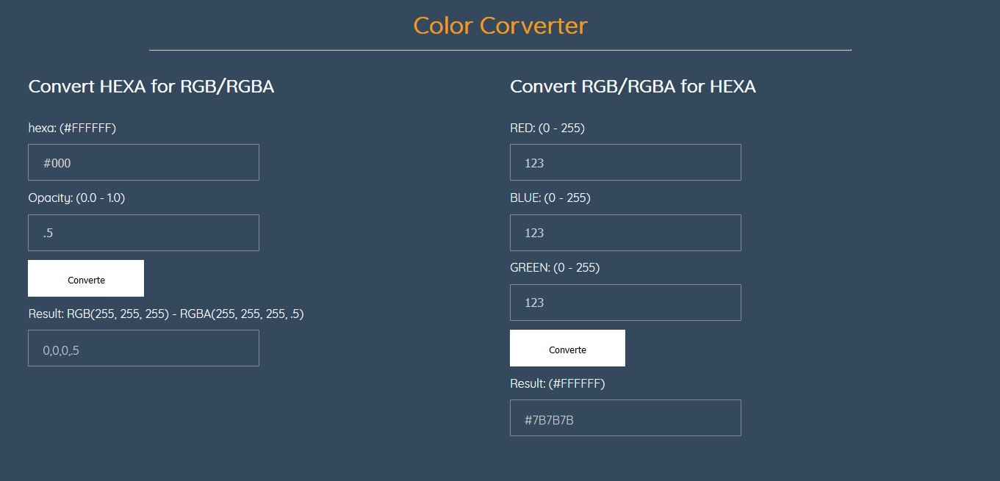

#Converso de cores HEXA e RGB/RGBA

Pequeno projeto com o intuito de converter cores hexadecimais para cores RGB/RGBA e converter cores RGB/RGBA em cores hexadecimais.

##Neste projeto foram utilizados:

 - HTML 5
 - CSS 3
 - Javascript

##Confira a demo do projeto:

<a href="https://thailoeduardo.github.io/color-conversion/"> DEMO </a>